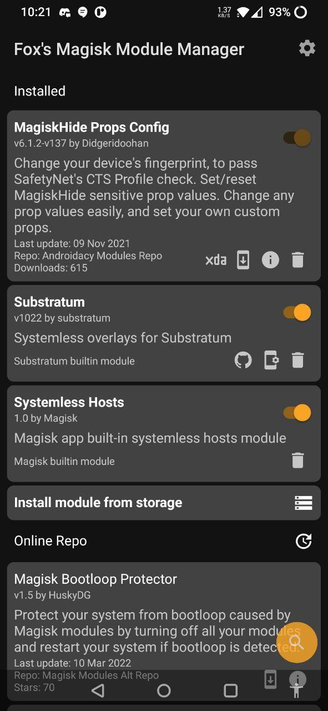
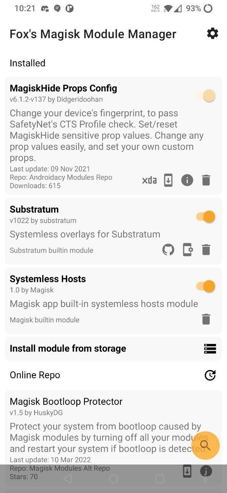

# Fox's Magisk Module Manager

  Important news

I have health problems that made me work slow on everything. I don't like sharing my health problmes
but it has been to much recently for me to keep it for myself.

This has been too much for me recently, so my moderators (same that on telegram)
will be handling the project for me for a while.

I had theses problems even before I started FoxMMM, the only reason no one noticed is because I can
work or go to any school because of how much pain and exhaustion I feel everyday.

The only two thing that helped me reduce the pain is making code and playing with friends.

Even tho I'm very slow at doing anything, the only thing that made me look like I was working on
this project at a normal speed like someone that work is because 75% of my time was on this project.

There was also some times I couldn't work on this projects for multiple days because of my health,
sometimes I was forcing myself to change one line of code from this project because doing nothing
was more painful that trying something while in pain.

Spending time with my friend and working on this project was a sort of pain killer for me.

Even tho I received money from my parent and the governement for my health problems, I didn't know
what to do with it cause anything I could have bought had no use for me because my extreme pain made
me unable to use anything (even play video games).

My health issues also prevented me to do any project of greater complexity that this, and without
community support I would have been physically unable to continue this project.

There was clues of my health problems, right on this project, and theses are the following:

- My commit time of day being random proving I have no jobs.
- Me not commiting for entire week, or having only commited one line in a week.
- Me taking too much time to publish release after I did the relase commit.
- Me missing obvious bugs and being able to do simple task properly
  (Well maybe this last one is harder to prove via commit history)

But since many people are faking health issues for clout, if any data-scientist want to do an
analysis to prove what it would make my day, and I would be happy to give money if someone does
that because I don't know what do to with my money at this point.

This is really sickening peoples need to give proof for their mental/health issues because some
peoples fake having thoses issues for clout.

If you want to use my health problems for clout, I don't care as long as you are respectful, at
least you won't be hurting peoples with mental/health issues by faking having thoses issues.

I'll probably delete this section once my health would be gotten better, or at least good enough for
me to not be stuck in my bed at least once a day because of pain.

## Community

## Screenshots

Main activity:  

## What is this?

The official Magisk has dropped support to download online modules, so I made Fox's Magisk Module
Manager to help you download and install Magisk modules.

**This app is not officially supported by Magisk or its developers**

**The modules shown in this app are not affiliated with this app or Magisk**  
(Please contact repo owners instead)

## Requirements

### Minimum / Recommended:

- Android 6.0+ / Android 7.0+
- Magisk 19.0+ / Magisk 21.2+
- An internet connection / A stable wifi connection

Note: This app may require the use of a VPN in countries with a state wide firewall.

## For users

To install the app go to [releases](https://github.com/Fox2Code/FoxMagiskModuleManager/releases),
and download and install the latest `.apk` on your device.

## Repositories Available

The app currently use these two repos as module sources, each with their own benefits and
drawbacks:  
(Note: Each module repo can be disabled in the settings of the app)  
(Note²: I do not own or actively monitor any of the repos or modules, **download at your own risk**)

#### [https://github.com/Magisk-Modules-Alt-Repo](https://github.com/Magisk-Modules-Alt-Repo)

- Accepting new modules [here](https://github.com/Magisk-Modules-Alt-Repo/submission)
- Less restrictive than the original repo
- Officially supported by Fox's mmm

Support:

#### [https://www.androidacy.com/modules-repo/](https://www.androidacy.com/modules-repo/)

- Accepting new modules [here](https://www.androidacy.com/module-repository-applications/)
- Modules downloadable easily outside the app
- Officially supported by Fox's mmm
- May show ads to help cover infrastrcture costs.
    - [Read more](https://www.androidacycom/doing-it-alone-the-what-the-how-and-the-why/)
      | [Privacy policy](https://www.androidacy.com/privacy/)
- Added features like module reviews, automatic VirusTotal scans, and more

Support:

If a module is in multiple repos, the manager will just pick the most up to date version of the
module, if a module is in multiple repos it will just use first registered repo.

Note: If you or a friend uploaded a module and it doesn't appear in your module list you can disable
the low quality filter in the app settings.  
Go to the [developer documentation](docs/DEVELOPERS.md) for more info.

## For developers

The manager can read new meta keys to allow modules to customize their own entry

It also use `minApi`, `maxApi` and `minMagisk` in the `module.prop` to detect compatibility  
And support the `support` and `donate` properties to allow them to add their own support links  
And if you want to be event fancier you can setup `config` to your own config app.  
(Note: the manager use fallback values for some modules, see developer documentation for more info)

It also add new ways to control the installer ui via a new `#!` command system  
It allow module developers to have a more customizable install experience

For more information please check the [developer documentation](docs/DEVELOPERS.md)

## For translators

**We need your help!** The app has started lagging behind in translations, and we need your help to catch up! As a reminder, translations are required to be at 60% or more to be included in the app.

### Recommended method

We use Weblate for translations: [https://translate.nift4.org/engage/foxmmm/](https://translate.nift4.org/engage/foxmmm/)

- You can create an account and start translating
- You may need to check your spam folder for the confirmation email

### GitHub method for advanced users

See [`app/src/main/res/values/strings.xml`](https://github.com/Fox2Code/FoxMagiskModuleManager/blob/master/app/src/main/res/values/strings.xml)

If your language is right to left don't forget to set `lang_support_rtl` to `true`.

Translators do not need to have any previous coding experience.

## Add your own repos

See [the documentation](docs/add-repo.md).

## Issues with a repo

If you have a problem with a repo, please contact the repo owner **first**. If you are unable to
reach them or they are not willing to help, you can contact us as a last resort.

Default repo owners:

- Androidacy: [Telegram](https://telegram.dog/androidacy_discussions)
- Magisk-Modules-Alt-Repo: [GitHub](https://github.com/Magisk-Modules-Alt-Repo/submission/issues)

## License

Fox's Magisk Manager, the icon, and names are copyright
2021-present [Fox2Code](https://github.com/Fox2Code). The Androidacy name, logo, integration, and
later portions of the code are copyright
2022-present [Androidacy](https://www.androidacy.com/?utm_source=fox-repo&utm_medium=web). See
[LICENSE](LICENCE) for details. Library licenses can be found in the licenses section of the app.

Modules are not covered by this license, please check the license of each module before using it.

Some third party backend services may be proprietary, please check their terms of service before
using them.

## Disclaimer

In no event shall the developer be liable for any special, direct, indirect, consequential, or
incidental damages or any damages whatsoever, whether in an action of contract, negligence or other
tort, arising out of or in connection with the use of the app or the contents of the app. The
developer reserves the right to make additions, deletions, or modification to the contents on the
app at any time without prior notice.

This app is not affiliated with Magisk or its developers, nor with any of the module repos or
developers of the modules.
