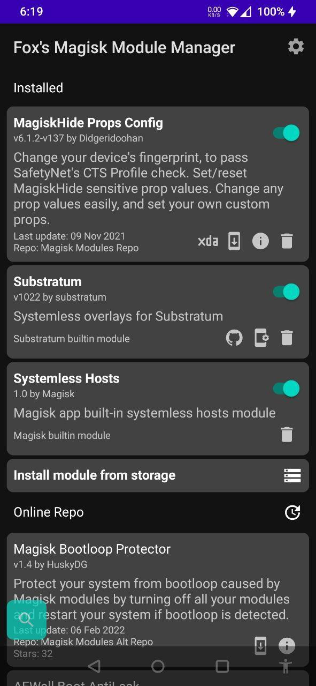

# Fox's Magisk Module Manager

The official Magisk is dropping support to download online modules...  
So I made my own app to do that! :3

**This app is not officially supported by Magisk or it's developers**

## Requirements

Minimum:
- Android 5.0+
- Magisk 19.0+
- An internet connection

Recommended:
- Android 6.0+
- Magisk 21.2+
- An internet connection

Note: This app may require the use of a VPN in countries with a state wide firewall.

## For users

Related commits:  
- [`Remove online section in modules fragment`](https://github.com/topjohnwu/Magisk/commit/f5c982355a2e3380b2b64af4b0caa8f4f7cf9157)
- [`Cleanup unused code`](https://github.com/topjohnwu/Magisk/commit/8d59caf635591eb23813d75601039bb138f5716b)

Note: These changes didn't hit beta, or release yet, but are already live on canary builds.

The app currently use these three repo as it's module sources, with it's benefits and drawback:  
(Note: Each module repo can be disabled in the settings of the app)

[https://github.com/Magisk-Modules-Alt-Repo](https://github.com/Magisk-Modules-Alt-Repo)  
- Accepting new modules [here](https://github.com/Magisk-Modules-Alt-Repo/submission)
- Less restrictive than the original repo
- Officially supported by Fox's mmm

[https://www.androidacy.com/modules-repo/](https://www.androidacy.com/modules-repo/)
- Accepting new modules [here](https://www.androidacy.com/module-repository-applications/)
- Modules downloadable easily outside the app
- Officially supported by Fox's mmm
- Contains ads

[https://github.com/Magisk-Modules-Repo](https://github.com/Magisk-Modules-Repo)  
- No longer accept new modules or receive update to existing modules
- May be shut down at any moment
- Official app dropped support for it
- End of life support by Fox's mmm

As the main repo may shutting down due to the main app no longer supporting it, 
stopped accepting new modules, and also no longer receive updates

If a module is in multiple repos, the manager will just pick the most up to date version 
of the module, allowing developers to switch repo at their own pace if they want to.

Note: If you or a friend uploaded a module and it doesn't appear in your module 
list you can disable the low quality filter in the app settings.  
Go to the [developer documentation](DEVELOPERS.md) for more info.

## Screenshots

Main activity:  

## For developers

The manager can read new meta keys to allow modules to customize their own entry

It also use `minApi`, `maxApi` and `minMagisk` in the `module.prop` to detect compatibility  
And support the `support` and `donate` properties to allow them to add their own support links  
And if you want to be event fancier you can setup `config` to your own config app.  
(Note: the manager use fallback values for some modules, see developer documentation for more info)

It also add new ways to control the installer ui via a new `#!` command system  
It allow module developers to have a more customizable install experience

For more information please check the [developer documentation](DEVELOPERS.md)

## For translators
See [`app/src/main/res/values/strings.xml`](https://github.com/Fox2Code/FoxMagiskModuleManager/blob/master/app/src/main/res/values/strings.xml)
and [`app/src/main/res/values/arrays.xml`](https://github.com/Fox2Code/FoxMagiskModuleManager/blob/master/app/src/main/res/values/arrays.xml)

If your language is right to left you should make a copy of [`app/src/main/res/values/bools.xml`](https://github.com/Fox2Code/FoxMagiskModuleManager/blob/master/app/src/main/res/values/bools.xml)
and set `lang_support_rtl` to `true`.

Translators are not expected to have any previous coding experience.

## I want to add my own repo

To add you own repo to Fox's mmm it need to follow theses conditions:
- The module repo or at least one of it's owners must be known.
- Modules in the repo must be monitored, and malicious modules must be removed.
- Module repo must have a valid, automatically or frequently updated `modules.json`
  ([Example](https://github.com/Magisk-Modules-Alt-Repo/json/blob/main/modules.json))

If all of these conditions are met you can open an issue for review.  
(And don't forget to include a link to the `modules.json`)
