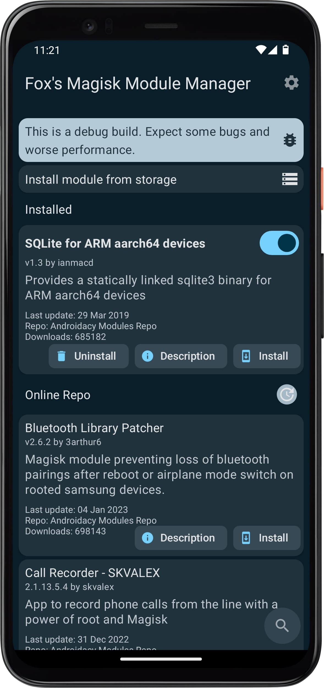
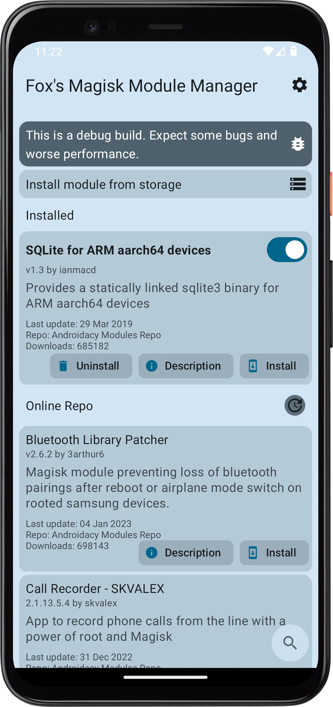

# Androidacy Module Manager

### Developed by Androidacy. Find us on the web [here](https://www.androidacy.com/?utm_source=fox-readme&utm_medium=web&utm_campagin=github).

_If you're seeing this at the Fox2Code repo, the new repo is at [Androidacy/AndroidacyModuleManager](https://github.com/Androidacy/AndroidacyModuleManager)! The old repo may not receive consistent updates anymore!_

## About

The official Magisk Manager app has dropped it's support for downloading online modules, leaving users without a way to easily search for and download them. This app was created to help users download and install modules, and manage their own modules.

**This app is not officially supported by Magisk or its developers**

**The modules shown in this app are not affiliated with this app or Magisk**.

## Features
- Download and install modules
- Manage your own modules
- Search for and download modules
- Supports custom repos
- Separate lists of local and remote modules
- Check for module updates automatically
- Monet theming
- Fully MD3 themed 
- (Coming soon) Repo creation wizard
- (Coming soon) Module creator

## Community

### We'd like to thank Fox2Code for his initial work on the app.

This app was previously known as Fox's Magisk Module Manager (FoxMMM) and may still be referred to as that. Androidacy thanks Fox2Code for their initial work on this app, and wishes him the best in his future endeavours.

## Screenshots

Main activity:

|                                  Dark theme                                   |                                   Light theme                                   |
|:-----------------------------------------------------------------------------:|:-------------------------------------------------------------------------------:|
|  |  |

## Requirements

### Minimum / Recommended:

- Android 7.0+ / Android 8.0+
- Magisk 19.0+ / Magisk 21.2+
- An internet connection / A stable wifi connection

Note: This app may require the use of a VPN in countries with a state wide firewall.

## Installation

To install the app go to [our website](https://www.androidacy.com/downloads/?view=FoxMMM),
and download and install the latest `.apk` for your architecture on your device.

## Repositories Available

#### Please note that we reserve the right to add, remove, and change default repos at any time, and the inclusion of any repo does not equate endorsement or any agreement with or of said repo.

The app currently use the below repos as module sources, each with their own benefits and
drawbacks. Note that the app developers do not actively monitor any repos, and downloading or
installing from them is at the user's own risk. Default repos can be enabled or disabled in-app.

#### [Androidacy](https://www.androidacy.com/magisk-modules-repository/?utm_source=fox-readme&utm_medium=web&utm_campagin=github)

- Accepting new
  modules [here](https://www.androidacy.com/module-repository-applications/?utm_source=fox-readme&utm_medium=web&utm_campagin=github)
- Modules downloadable easily outside the app
- Rigorously reviewed and tested modules
- Officially supported by Fox's mmm
- May show ads to help cover infrastructure costs.
    - [Read more](https://www.androidacycom/doing-it-alone-the-what-the-how-and-the-why/?utm_source=fox-readme&utm_medium=web&utm_campagin=github)
      | [Privacy policy](https://www.androidacy.com/privacy/?utm_source=fox-readme&utm_medium=web&utm_campagin=github)
- Added features like module reviews, automatic VirusTotal scans, and more.
    - Pays module developers for their work as part of the Revenue Sharing Program 

**Support:**

&emsp; 

#### [Magisk Alt Repo](https://github.com/Magisk-Modules-Alt-Repo)

- Accepting new modules [here](https://github.com/Magisk-Modules-Alt-Repo/submission)
- Less restrictive than the original repo
    - May have lower quality, untested, or otherwise broken modules due to their policies or lack
      thereof.
- Officially supported by Fox's mmm
- Disabled by default and no longer recommended. Kept as an alternative for those who want it

**Support:**

&emsp; 

**Please do not use GitHub issues for help or questions. GitHub issues are specifically for bug
reporting and general app feedback.**

If a module is in multiple repos, the manager will just pick the most up to date version of the
module, if a module is in multiple repos it will just use first registered repo.

## For developers

The manager can read a few new meta keys to allow modules to customize their own entry

It also use `minApi`, `maxApi` and `minMagisk` in the `module.prop` to detect compatibility  
And support the `support` and `donate` properties to allow them to add their own support links  
And if you want to be event fancier you can setup `config` to your own config app.  
(Note: the manager use fallback values for some modules, see developer documentation for more info)

It also add new ways to control the installer ui via a new `#!` command system  
It allows module developers to craft a more customizable install experience.

If you created and uploaded a module and it doesn't appear in your module list you can disable
the low quality filter in the app settings after enabling developer mode. **Ideally, we recommend you to fix your module metadata rather than disabling that filter.**

For more information please check the [developer documentation](docs/DEVELOPERS.md)

## Help us make our app more accessible!

**We need your help!** The app has started lagging behind in translations, and we need your help to
catch up! As a reminder, translations are required to be at 60% or more to be included in the app.

### Weblate (recommended)

We use Weblate for
translations: [https://translate.nift4.org/engage/foxmmm/](https://translate.nift4.org/engage/foxmmm/)

- You can create an account and start translating
- You may need to check your spam folder for the confirmation email

### GitHub method (advanced users)

See [`app/src/main/res/values/strings.xml`](https://github.com/Fox2Code/FoxMagiskModuleManager/blob/master/app/src/main/res/values/strings.xml)

If your language is right to left don't forget to set `lang_support_rtl` to `true`.

Translators do not need to have any previous coding experience.

## Add your own repos

See [the documentation](docs/add-repo.md).

## Issues with a repo

If you have a problem with a repo, please contact the repo owner **first**. If you are unable to
reach them or they are not willing to help, you can contact us as a last resort.

_The developers of this app are unable to help with any issues arising from use or installation of
modules, and may be of limited help with issues arising from a specific repo._

Default repo owners:

- Androidacy: [Telegram](https://telegram.dog/androidacy_discussions)
- Magisk-Modules-Alt-Repo: [GitHub](https://github.com/Magisk-Modules-Alt-Repo/submission/issues)

Custom repos may have their own support channels, and we are unable to provide any support
whatsoever for them, outside of direct implementation bugs.

## License

Fox's Magisk Module Manager, the icon, and names are copyright
2021-present [Fox2Code](https://github.com/Fox2Code). The Androidacy name(s), logo, integration, and
later portions of the code are copyright
2022-present [Androidacy](https://www.androidacy.com/?utm_source=fox-repo&utm_medium=web). See
[LICENSE](LICENCE) for details. Library licenses can be found in the licenses section of the app.

Modules and their files, names, and other assets are not covered by this license or other
agreements, and are not warranted, checked, or otherwise guaranteed by the authors of this app, and may have their own licenses, agreements, and terms, of which the author(s) of this app do not check or have any responsibility for.

Some third party backend services may have additional terms, please check their
terms of service before
using them.

## EULA

The EULA can be found [here](https://www.androidacy.com/foxmmm-eula/). By downloading, installing,
or using this app you agree to the supplemental terms of the EULA.

**IN NO EVENT SHALL THE AUTHORS OR COPYRIGHT HOLDERS BE LIABLE FOR AN CLAIM, DAMAGES OR OTHER
LIABILITY, WHETHER IN AN ACTION OF CONTRACT, TORT OR OTHERWISE, ARISING FROM, OUT OF OR IN
CONNECTION WITH THE SOFTWARE OR THE USE OR OTHER DEALINGS IN THE SOFTWARE.**
